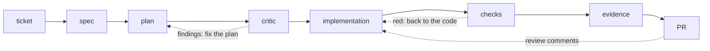

# BEVN-202 — Session Waitlist

> Phase 2 — New Features · both tracks · SPEC-DRIVEN
> Rules & route: [README.md](../README.md)

When a session has reached its capacity, an attendee can join a waitlist. If a registered attendee cancels, the first person on the waitlist is automatically promoted to a confirmed registration. This promotion should be logged. The session detail page shows current registration count, capacity, and waitlist count.

**Definition of Done:**
- [ ] `POST /api/sessions/{id}/waitlist` adds an attendee to the waitlist
- [ ] Registering for a session at capacity returns 409 — does not auto-waitlist
- [ ] Cancelling a confirmed registration triggers automatic promotion of the next waitlisted attendee
- [ ] Promotion is logged at INFO level with attendee ID and session ID
- [ ] `GET /api/sessions/{id}` response includes `registeredCount`, `capacity`, `waitlistCount`
- [ ] Session detail page shows capacity and waitlist count
- [ ] Unit tests cover: join waitlist, cancel triggers promotion, waitlist ordering

---

> **Pilot addition — the operator on every step.** The DoD above defines *what* to build. This addition defines *how you watch yourself work* and adds deliverables to the same PR.

On a spec-driven task it is easy to experience the pipeline as ceremony — you write a spec because the rules demand one, you commit a plan because the reviewer will look for it. But the pipeline exists for a different reason: the agent writes the code, and **you are present at every step as the operator** — the person who catches what the agent got wrong *before* it becomes expensive. You validate with what you know, and you cannot check a layer you don't understand. On this task you make that work visible.

The task flows through the conveyor — and not in a straight line: three steps can send work back.

Every dotted edge starts at a **gate**: a point where someone gives an explicit verdict — forward, or back. *Gate* is the word you will hear daily on a factory project. (And on a real project the returns can go deeper than the diagram shows: even the spec is reopenable when implementation reveals it was wrong — the acceptance criteria have an owner, not a freeze date.)

Both of you are present on every step, and on every step the jobs are different:

| Conveyor step | What the coding agent does | What the operator does |
|---|---|---|
| **ticket** | explores the codebase on request | understands the requirement, finds the parts of the system it touches, asks questions where it is unclear |
| **spec** | drafts the spec from your conversation | owns the acceptance criteria; resolves the contentious cases in writing, before any code |
| **plan** | writes the step-by-step plan | reads it end to end and checks it against the spec |
| **critic** | a *different*, fresh agent session — not your coding agent — performs the adversarial pass | commissions it, hands it only the spec and the plan, and gives every finding an explicit verdict |
| **implementation** | writes the code, runs commands, fixes what breaks | watches context and cost, stops early, intervenes by hand when needed |
| **checks** | runs tests and lint, chases failures | knows what the tests actually run and what really blocks the merge |
| **evidence** | puts the ticket number where it is told to | enforces traceability: ticket number in the branch; spec, plan, journal, and the record that the checks really ran — committed to the repository |
| **PR** | drafts the description, summarizes the change | reads the diff, validates the result independently of the agent's summary |

One naming note: the *critic* is a pattern, not a single step — a fresh session with a narrow brief and an explicit verdict on every finding. In production it runs at least twice: on the plan, as here, and again on the completed diff before merge — that second pass is exactly [EXT-303](../side-quests/EXT-303-critic-before-merge.md), and on a real factory a review gate like that blocks the path to the PR. This task exercises the plan-level pass.

**Tooling:** unchanged — the usual spec-driven setup (in Claude Code, the superpowers plugin, whose brainstorming → spec → plan → implementation flow drives part of this conveyor; in another agent, the equivalent flow with `spec.md` and `plan.md` committed). Notice, though, that the tooling orchestrates only part of the map: nobody runs the critic, keeps the evidence, or validates the PR for you. Seeing where the automation ends and the operator begins is part of the exercise.

**The operator journal:** keep `docs/operator-journal.md` in the task branch. One entry per conveyor step, written *at* that step, not reconstructed afterwards. Each entry answers three questions:

1. What did I do here that the agent could not or should not do for me?
2. What did I catch, question, or decide? (Or honestly: nothing — and what did I check to conclude that?)
3. What has the task cost so far?

(If you later take [EXT-306](../side-quests/EXT-306-cost-of-your-work.md), this journal's cost line is ready input.)

**Additional Definition of Done:**
- [ ] The journal has an entry for every step of the conveyor, and the commit history shows the entries were written along the way, not backfilled at the end
- [ ] The *ticket* entry records at least one question you asked about the requirements (or names the ambiguity you looked for and didn't find)
- [ ] The *plan* or *critic* entry records at least one silent decision the agent made that the ticket didn't ask for (there is always at least one) — with your explicit verdict on it
- [ ] The *PR* entry records how you validated the result yourself, without relying on the agent's summary
- [ ] A closing debrief in the journal: which step turned out to be the most work for you as operator — and is that where you expected it?

**What stays in whose head.** When this task merges, the agent's head — its context window — is compacted and discarded. Everything it "learned" about waitlists, promotions, and your codebase: gone. Tomorrow's session arrives as a bright, confident stranger who has never heard of BEVN-202. (This is not a bug to fix but a fact to design around — it is why project knowledge files and skills exist; see [EXT-301](../side-quests/EXT-301-project-knowledge-file.md) and [EXT-304](../side-quests/EXT-304-first-skill.md).) What stays in *your* head is different: the domain, the map of the system, the scar from the silent decision you almost let through. Of the two of you, only one accumulates — and the journal is how you check that it's you.
